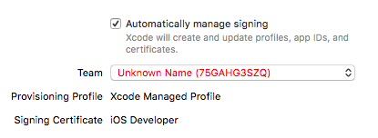
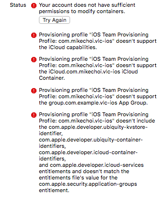

# Common Beginner Issues

So you just ran 

```bash
git clone https://github.com/videolan/vlc-ios.git
```

after finally deciding that you wanted to contribute to VLC-iOS. First thing is first; **welcome to the community 🎉.** To get you settled in, here are couple of issues beginners tend to run into when first trying to build and run the app.

> Note that you can just follow these steps in order to build and run VLC-iOS after just having cloned the repository.

## 1. Code signing

When you first clone the project, the code signing will be under an invalid team. If you go to `Targets -> VLC-iOS -> General`, you will see the following




This one is easy to solve. 

1. Press the drop down menu and choose a valid team
   - If you don't have anything listed, you may need to sign in to your developer account by pressing the button `Team -> Add an account`.
2. Change the bundle identifier at the top of the screen

```
com.example.vlc-[target] -> com.YOUR_CUSTOM_DOMAIN_HERE.vlc-[target]
```

> **⚠️ Make sure to do this for every single target in the `Targets` panel.** 

## 2. App Groups

You may notice that after you made the above changes, some targets correctly generated a signing certificate. However, for those that did not, you may see something like this.



The problem here is that VLC-iOS utilizes iCloud container & App Groups. These features require you to be a member of the VLC-iOS development team. However, since you are not, you do not have the permission to access those capabilities; hence the warnings 🤷‍♂️. Here are the steps to fix this issue.

1. Go to the **Capabilities** tab 
2. Turn off **App Groups** and **Keychain Sharing** if present
3. Repeat for all targets

> If you plan on contributing something that involves App Groups or Keychain Sharing, please contact us and we will work something out!

## 3. iCloud Permissions

In the previous step, we dealt with permission errors regarding App Groups. Here, we will deal with iCloud permission errors. 

1. In the left panel, expand the folder `iOS Supporting Files` and click `VLC for iOS.entitlements`
2. Delete all the subitems of `Entitlements File`
3. Repeat steps 2 and 3 for `VLC-TV.entitlements` under `VLC-TV/Resources`

> If the target **VLC-tvOS** is still giving you troubles and you are not planning on building the tvOS app, go to its **General**  tab and select `None` in the **Team** dropdown menu 

**Now, you should be ready to build and run your VLC-iOS for the first time 🎉🎉🎉**

